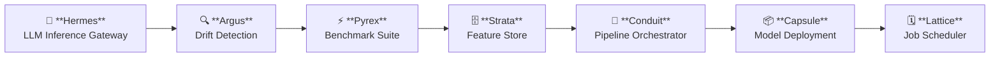
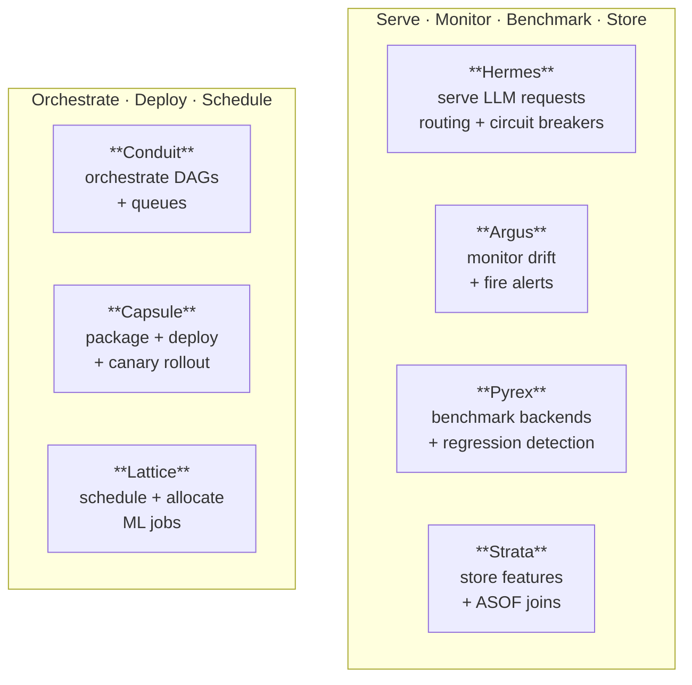
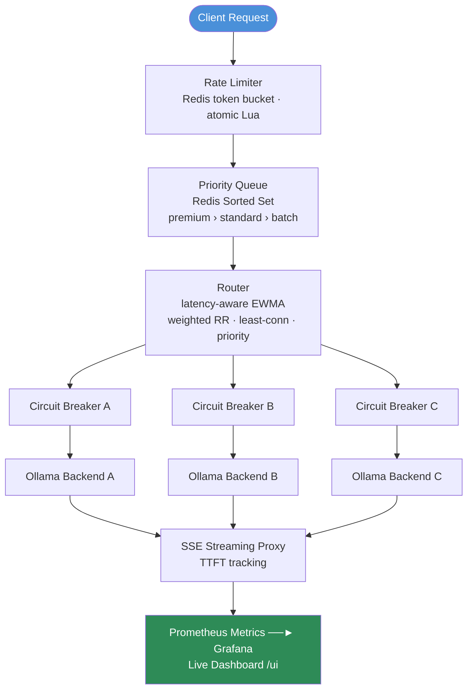
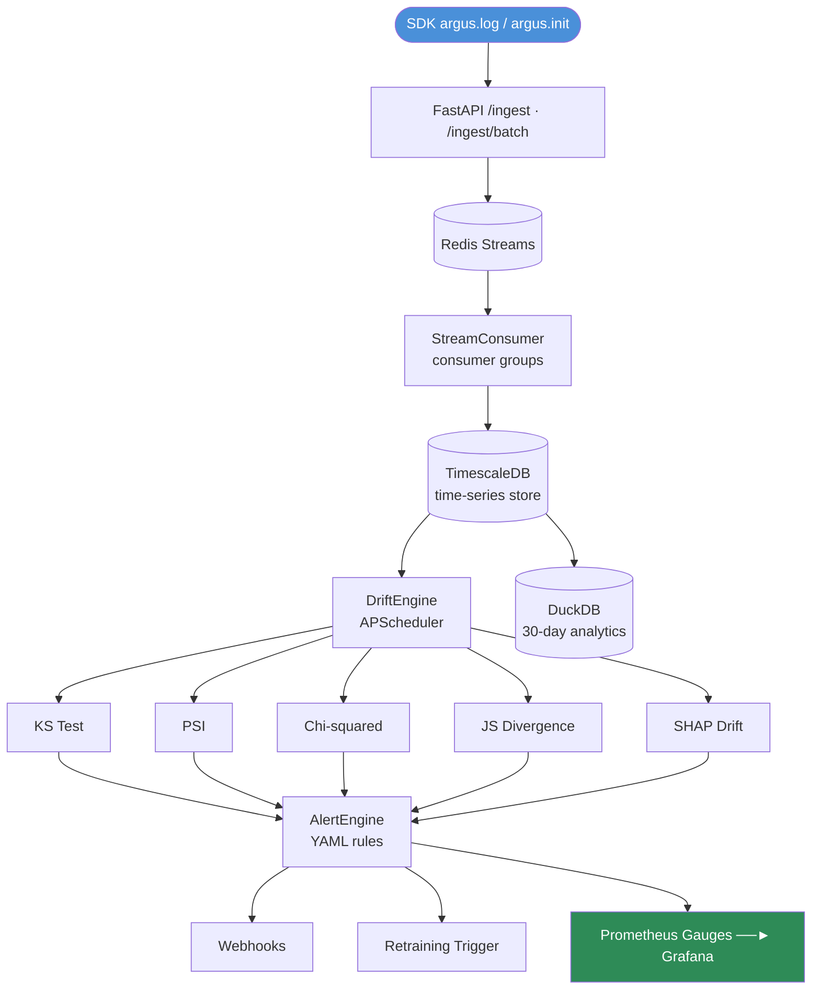
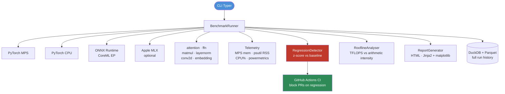
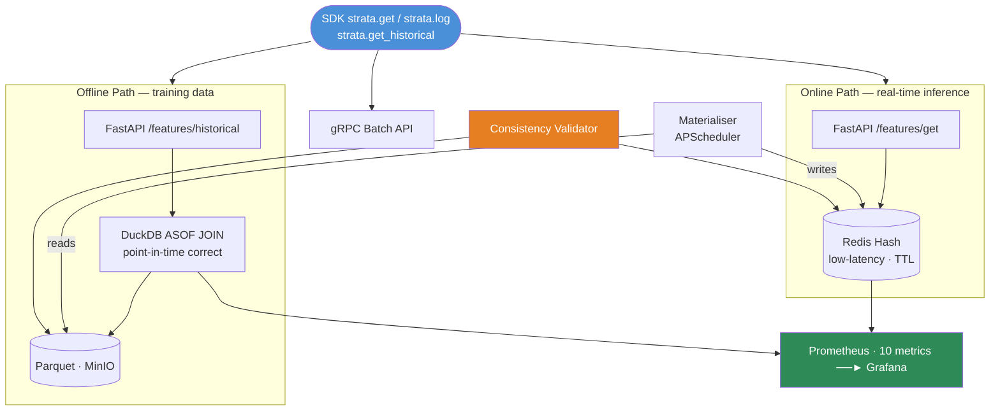
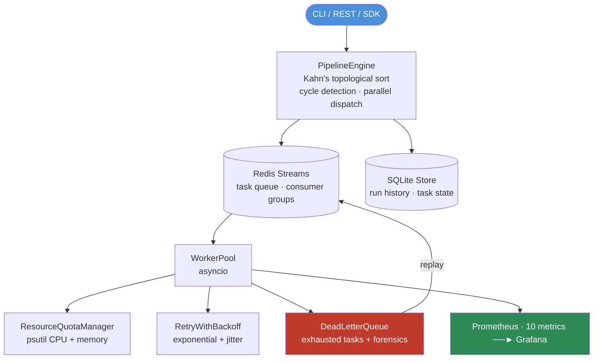
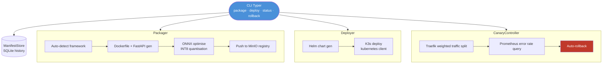
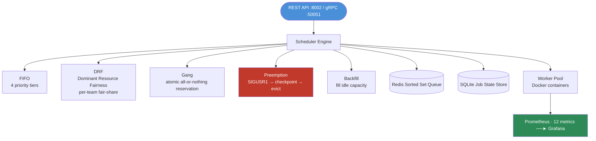
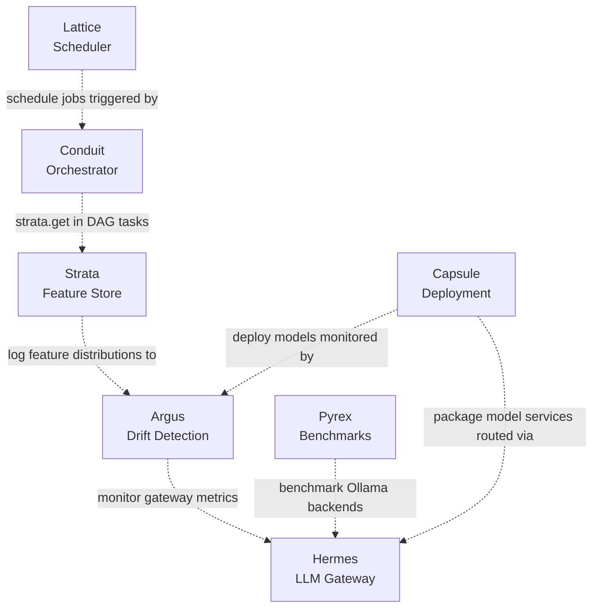

# AI Hive — Architecture

AI Hive is a collection of seven independently deployable infrastructure systems. Each project solves a distinct layer of the production ML infrastructure stack and can be run, tested, and deployed on its own.

---

## System Overview

---

## ML Infrastructure Lifecycle

---

## Individual System Architectures

### Hermes — LLM Inference Gateway

---

### Argus — ML Observability Platform

---

### Pyrex — Benchmark Suite

---

### Strata — Feature Store

---

### Conduit — ML Pipeline Orchestrator

---

### Capsule — Model Deployment Platform

---

### Lattice — ML Job Scheduler

---

## Optional Integrations

These integrations show how the systems can work together. **They are optional — no project requires another to run.**

> Dashed arrows = optional integrations. All systems run independently.

---

## Design Principles

1. **Local-first** — designed for Apple Silicon, zero cloud dependency
2. **Independent deployability** — each project runs standalone with `docker compose up`
3. **No cross-project runtime dependencies** — Hermes does not require Argus; Strata does not require Conduit
4. **Production-style patterns** — circuit breakers, rate limiting, dead letter queues, ASOF joins, canary deployments
5. **Observable by default** — Prometheus metrics and Grafana dashboards across all projects that serve traffic
6. **Testable without dependencies** — every project's test suite runs without external services (mocked)
