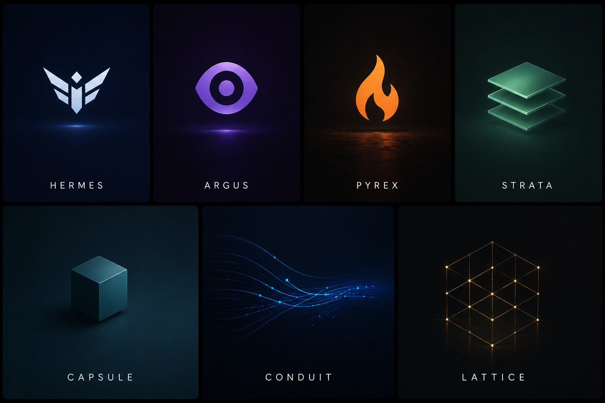
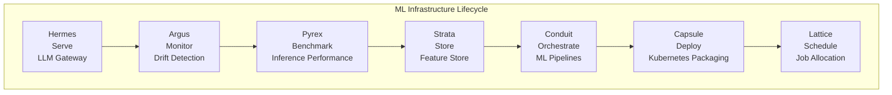
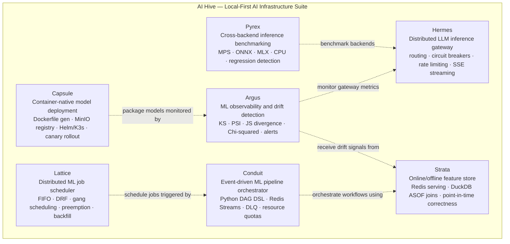

<p align="center">
  
</p>

<h1 align="center">AI Hive</h1>

<p align="center">
  <strong>Local-First AI Infrastructure Suite</strong>
</p>

<p align="center">
  Seven independently deployable systems for model serving, observability, benchmarking,
  feature management, orchestration, deployment, and scheduling.
</p>

<p align="center">
  
  
  
  
  
</p>

---

## Overview

**AI Hive** is a local-first AI infrastructure suite made of seven independently deployable systems.

It covers the core lifecycle of modern AI infrastructure:

```text
serve → monitor → benchmark → store features → orchestrate pipelines → deploy models → schedule jobs
```

The suite is designed to run on local hardware with zero cloud dependency while demonstrating production-style infrastructure patterns used in model serving platforms, MLOps systems, feature stores, orchestration engines, deployment platforms, and cluster schedulers.

---

## Projects

| Project                                                               | Role           | Description                                                                                                           |
| --------------------------------------------------------------------- | -------------- | --------------------------------------------------------------------------------------------------------------------- |
| **[Hermes](https://github.com/Gopal-Singh-Subramani-Singh/hermes)**   | Serve          | Distributed LLM inference gateway with routing, circuit breakers, rate limiting, streaming, and observability         |
| **[Argus](https://github.com/Gopal-Singh-Subramani-Singh/argus)**     | Monitor        | ML observability and drift detection platform with statistical tests, alerts, and dashboards                          |
| **[Pyrex](https://github.com/Gopal-Singh-Subramani-Singh/pyrex)**     | Benchmark      | Cross-backend inference benchmarking suite for Apple Silicon across PyTorch MPS, ONNX Runtime, MLX, and CPU           |
| **[Strata](https://github.com/Gopal-Singh-Subramani-Singh/strata)**   | Store Features | Online/offline feature store with Redis serving, DuckDB/Parquet storage, MinIO, and point-in-time joins               |
| **[Conduit](https://github.com/Gopal-Singh-Subramani-Singh/conduit)** | Orchestrate    | Event-driven ML pipeline orchestrator with Python DAG DSL, Redis Streams, retries, and dead letter queues             |
| **[Capsule](https://github.com/Gopal-Singh-Subramani-Singh/capsule)** | Deploy         | Container-native model deployment platform with Dockerfile generation, MinIO registry, Helm/K3s, and canary workflows |
| **[Lattice](https://github.com/Gopal-Singh-Subramani-Singh/lattice)** | Schedule       | Distributed ML job scheduler simulation with fair-share scheduling, gang scheduling, preemption, and backfill         |

---

## Architecture

### Infrastructure Lifecycle



### Optional System Integrations



Each system runs independently. The dashed lines represent optional integrations, not runtime dependencies.

See [ARCHITECTURE.md](./ARCHITECTURE.md) for detailed per-system diagrams.

---

## Design Principles

| Principle                                        | Meaning                                                                                                      |
| ------------------------------------------------ | ------------------------------------------------------------------------------------------------------------ |
| **Local-first**                                  | Built to run on local hardware, including Apple Silicon                                                      |
| **Zero cloud dependency**                        | No paid cloud services required                                                                              |
| **Independent deployability**                    | Each project can run as its own standalone repository                                                        |
| **No required cross-project runtime dependency** | Hermes does not require Argus; Strata does not require Conduit                                               |
| **Production-style patterns**                    | Circuit breakers, rate limiting, drift detection, ASOF joins, DLQs, canary deployment, fair-share scheduling |
| **Observable by default**                        | Systems expose Prometheus metrics and include Grafana/dashboard support                                      |
| **Testable locally**                             | Projects include pytest-based validation workflows with mocked external dependencies where appropriate       |

---

## Tech Stack

| Area                       | Tools                                                            |
| -------------------------- | ---------------------------------------------------------------- |
| Languages                  | Python                                                           |
| APIs                       | FastAPI, Flask, HTTP/REST, gRPC, SSE                             |
| AI / ML                    | PyTorch, ONNX Runtime, Apple MLX, Ollama, SHAP                   |
| Data Stores                | Redis, TimescaleDB, DuckDB, SQLite                               |
| Storage                    | MinIO, Parquet                                                   |
| Infrastructure             | Docker, Docker Compose, Kubernetes/K3s, Helm                     |
| Observability              | Prometheus, Grafana                                              |
| Scheduling / Orchestration | APScheduler, Redis Streams, DAG execution, fair-share scheduling |

---

## Optional Integrations

AI Hive is designed as a suite of independent systems that can also be composed:

* **Argus** can monitor model and gateway signals from **Hermes**
* **Pyrex** can benchmark local model backends used by **Hermes**
* **Capsule** can package model services that are later monitored by **Argus**
* **Conduit** can orchestrate ML workflows that consume **Strata** features
* **Lattice** can schedule jobs triggered by **Conduit** pipelines
* **Argus** can monitor drift in features served by **Strata**

These integrations are optional. Each repository remains independently runnable.

---

## Quick Start

Each project has its own setup instructions. The snippets below show the typical local entry points.

### Hermes — LLM Gateway

```bash
cd hermes
pip install -r requirements.txt
docker run -d -p 6379:6379 redis:7-alpine
uvicorn gateway.main:app --port 8000
```

### Argus — Drift Detection

```bash
cd argus
pip install -r requirements.txt
docker compose up timescaledb redis prometheus grafana -d
uvicorn argus_core.main:app --port 8001
```

### Pyrex — Benchmarking

```bash
cd pyrex
pip install -e .
pyrex run --quick
```

### Strata — Feature Store

```bash
cd strata
pip install -r requirements.txt
docker compose up redis minio prometheus grafana -d
uvicorn strata_core.main:app --port 8003
```

### Conduit — Pipeline Orchestrator

```bash
cd conduit
pip install -r requirements.txt
docker compose up redis prometheus grafana -d
uvicorn conduit_api.main:app --port 8004
```

### Capsule — Model Deployment

```bash
cd capsule
pip install -e .
docker compose up minio registry -d
capsule package --manifest examples/fraud_detector/capsule.yaml
```

### Lattice — Job Scheduler

```bash
cd lattice
pip install -r requirements.txt
docker compose up redis prometheus grafana -d
uvicorn lattice.api.rest_api:app --port 8002
```

---

## Integration Demo

See [INTEGRATION_DEMO.md](./INTEGRATION_DEMO.md) for an end-to-end demo connecting multiple systems.

---

## Repository Structure

AI Hive is published as an umbrella landing repository with links to seven standalone project repositories.

```text
ai-hive/
├── ARCHITECTURE.md
├── INTEGRATION_DEMO.md
├── PROJECTS.md
├── ROADMAP.md
├── README.md
├── ai_hive.png
└── docs/
```

The individual systems live in their own repositories:

```text
hermes/
argus/
pyrex/
strata/
conduit/
capsule/
lattice/
```

---

## Documentation

| Document                                     | Purpose                                |
| -------------------------------------------- | -------------------------------------- |
| [ARCHITECTURE.md](./ARCHITECTURE.md)         | Detailed architecture and design notes |
| [PROJECTS.md](./PROJECTS.md)                 | Project-by-project overview            |
| [INTEGRATION_DEMO.md](./INTEGRATION_DEMO.md) | Multi-system integration walkthrough   |
| [ROADMAP.md](./ROADMAP.md)                   | Future work and planned improvements   |

---

## License

This repository is publicly visible for portfolio and educational review purposes.

No permission is granted to copy, modify, distribute, sublicense, or use this code in commercial or non-commercial projects without explicit written permission unless a separate license file states otherwise.

---

## Contact

Built by **Gopal Singh Subramani Singh**

GitHub: [@Gopal-Singh-Subramani-Singh](https://github.com/Gopal-Singh-Subramani-Singh)

LinkedIn: [gopalsinghs](https://linkedin.com/in/gopalsinghs/)

---

## Acknowledgments

AI Hive was built as a deep systems engineering project to explore production AI infrastructure patterns locally.

Each system implements patterns inspired by real-world distributed systems, MLOps platforms, model serving systems, feature stores, pipeline orchestrators, deployment platforms, and cluster schedulers.
