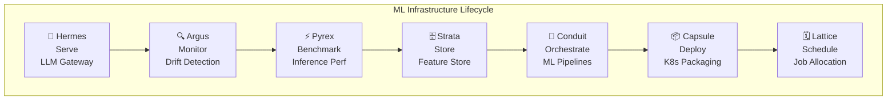
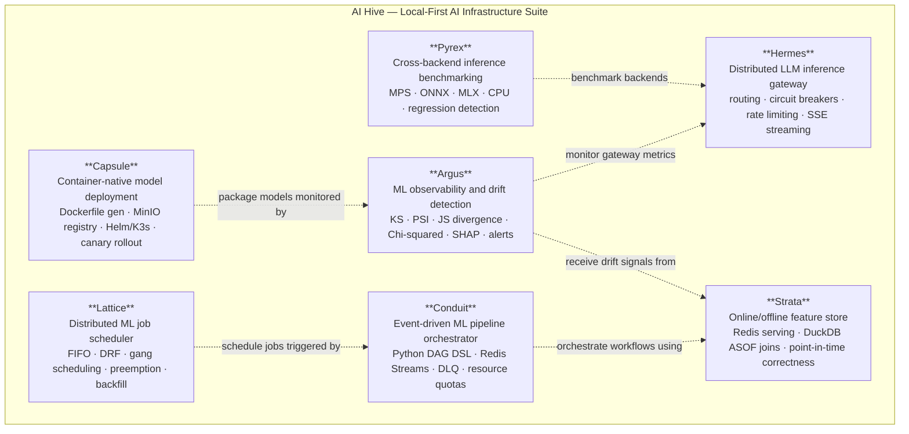

# AI Hive — Local-First AI Infrastructure Suite

AI Hive is a local-first AI infrastructure suite made of seven independently deployable systems for model serving, observability, benchmarking, feature management, orchestration, deployment, and scheduling. The suite is designed to run on local hardware with zero cloud dependency while demonstrating production-style AI infrastructure patterns.

---

## Projects

| Project | Role in AI Hive | Description |
|---------|----------------|-------------|
| **[Hermes](https://github.com/Gopal-Singh-Subramani-Singh/hermes)** | Serve | Distributed LLM inference gateway with routing, circuit breakers, rate limiting, streaming, and observability |
| **[Argus](https://github.com/Gopal-Singh-Subramani-Singh/argus)** | Monitor | ML observability and drift detection platform with statistical tests, alerts, and dashboards |
| **[Pyrex](https://github.com/Gopal-Singh-Subramani-Singh/pyrex)** | Benchmark | Cross-backend inference benchmarking suite for Apple Silicon (PyTorch MPS, ONNX Runtime, MLX, CPU) |
| **[Strata](https://github.com/Gopal-Singh-Subramani-Singh/strata)** | Store Features | Online/offline feature store with Redis serving, DuckDB/Parquet storage, and point-in-time joins |
| **[Conduit](https://github.com/Gopal-Singh-Subramani-Singh/conduit)** | Orchestrate | Event-driven ML pipeline orchestrator with Python DAG DSL, Redis Streams, retries, and DLQ |
| **[Capsule](https://github.com/Gopal-Singh-Subramani-Singh/capsule)** | Deploy | Container-native model deployment platform with Dockerfile generation, MinIO registry, Helm/K3s, and canary workflows |
| **[Lattice](https://github.com/Gopal-Singh-Subramani-Singh/lattice)** | Schedule | Distributed ML job scheduler simulation with fair-share scheduling, gang scheduling, preemption, and backfill |

> **Note**: Replace `YOUR_USERNAME` with your actual GitHub username or organization name after creating repositories.

---

## Lifecycle

```
serve → monitor → benchmark → store features → orchestrate pipelines → deploy models → schedule jobs
```

---

## Architecture





> Optional integrations shown as dashed lines. Each system runs fully independently.

See [ARCHITECTURE.md](./ARCHITECTURE.md) for detailed per-system architecture diagrams.

---

## Tech Stack

**Languages**: Python  
**Frameworks**: FastAPI, Flask  
**Databases**: Redis, TimescaleDB, DuckDB, SQLite  
**Storage**: MinIO, Parquet  
**Orchestration**: Kubernetes/K3s, Helm, Docker  
**Observability**: Prometheus, Grafana  
**ML/AI**: PyTorch, ONNX Runtime, Apple MLX, Ollama, SHAP  
**Protocols**: gRPC, HTTP/REST, SSE (Server-Sent Events)

---

## Design Principles

1. **Local-first** — Designed for Apple Silicon, zero cloud dependency
2. **Independent deployability** — Each project runs standalone with `docker compose up`
3. **No cross-project runtime dependencies** — Hermes does not require Argus; Strata does not require Conduit
4. **Production-style patterns** — Circuit breakers, rate limiting, dead letter queues, ASOF joins, canary deployments, drift detection
5. **Observable by default** — All systems export Prometheus metrics and include Grafana dashboards
6. **Testable** — Each project has 30+ pytest tests, all mocked for fast execution

---

## Optional Integrations

While each system is independently runnable, they can be composed:

- **Argus** can monitor **Hermes** metrics (LLM gateway drift detection)
- **Pyrex** can benchmark **Hermes** backends (inference performance analysis)
- **Capsule** can package and deploy model services monitored by **Argus**
- **Conduit** can orchestrate workflows that use **Strata** features
- **Lattice** can schedule jobs triggered by **Conduit** pipelines

These are **optional integrations**. Each system is independently runnable.

---

## Quick Start

Each project can be started independently. See individual project READMEs for full instructions.

### Hermes (LLM Gateway)
```bash
cd hermes
pip install -r requirements.txt
docker run -d -p 6379:6379 redis:7-alpine
uvicorn gateway.main:app --port 8000
```

### Argus (Drift Detection)
```bash
cd argus
pip install -r requirements.txt
docker compose up timescaledb redis prometheus grafana -d
uvicorn argus_core.main:app --port 8001
```

### Pyrex (Benchmarking)
```bash
cd pyrex
pip install -e .
pyrex run --quick
```

### Strata (Feature Store)
```bash
cd strata
pip install -r requirements.txt
docker compose up redis minio prometheus grafana -d
uvicorn strata_core.main:app --port 8003
```

### Conduit (Pipeline Orchestrator)
```bash
cd conduit
pip install -r requirements.txt
docker compose up redis prometheus grafana -d
uvicorn conduit_api.main:app --port 8004
```

### Capsule (Model Deployment)
```bash
cd capsule
pip install -e .
docker compose up minio registry -d
capsule package --manifest examples/fraud_detector/capsule.yaml
```

### Lattice (Job Scheduler)
```bash
cd lattice
pip install -r requirements.txt
docker compose up redis prometheus grafana -d
uvicorn lattice.api.rest_api:app --port 8002
```

---

## Integration Demo

See [INTEGRATION_DEMO.md](./INTEGRATION_DEMO.md) for a full end-to-end demo connecting multiple systems.


## Project Structure

```
ai-hive/                    # Umbrella landing repository
├── hermes/                 # LLM inference gateway
├── argus/                  # ML observability platform
├── pyrex/                  # Inference benchmark suite
├── strata/                 # Feature store
├── conduit/                # Pipeline orchestrator
├── capsule/                # Model deployment platform
└── lattice/                # Job scheduler
```

---

## License

Each project contains its own license. Please refer to individual project repositories.

---

## Contributing

Contributions are welcome! Each project is independently maintained. Please refer to individual project repositories for contribution guidelines.

---

## Contact

Built by [Gopal Singh]  
GitHub: [@Gopal-Singh-Subramani-Singh](https://github.com/Gopal-Singh-Subramani-Singh)  
LinkedIn: [gopalsinghs](https://linkedin.com/in/gopalsinghs/)

> **Note**: Replace with your actual contact information after creating repositories.

---

## Acknowledgments

AI Hive was built as a learning project to go deep into production AI infrastructure patterns. Each system implements patterns from real-world distributed systems and MLOps platforms.

---

**Last Updated**: 2026-07-04
